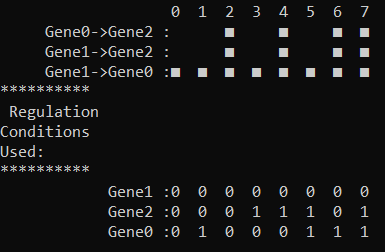
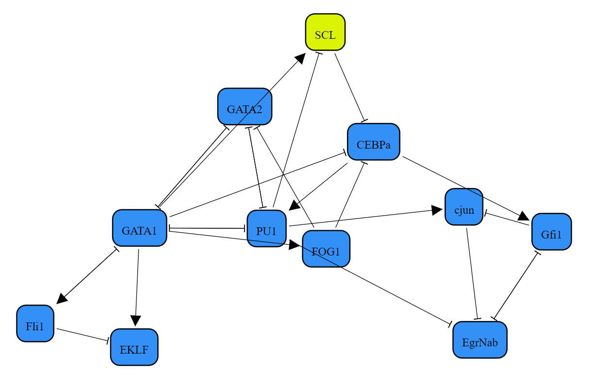
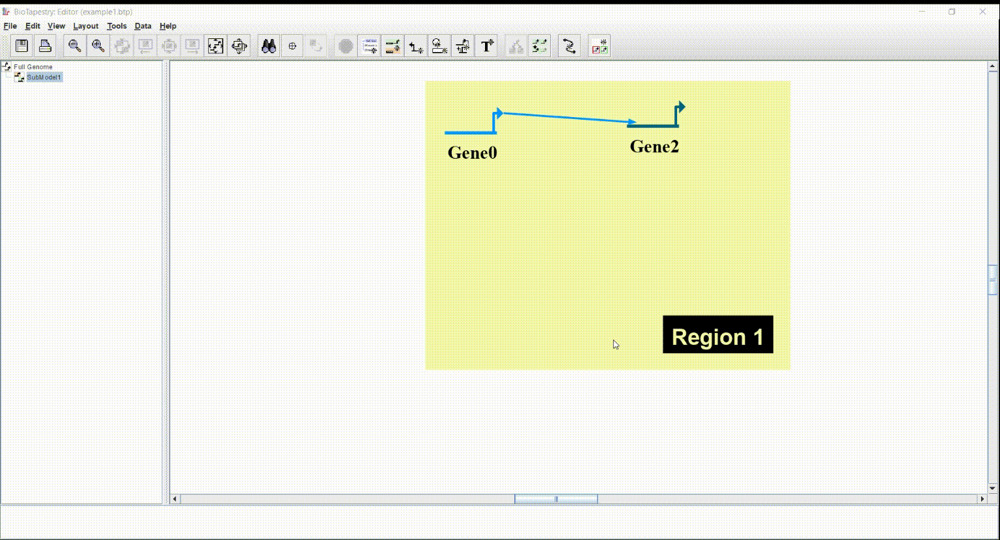

# BIU/YU Summer Research Program | Computer Science Students
Under the guidance of Dr. Hillel Kugler

>*NOTE: this README assumes prior familiarity with [RE:IN](https://www.microsoft.com/en-us/research/project/reasoning-engine-for-interaction-networks-rein/) and [BRE:IN](https://github.com/kuglerh/BREIN).

## Projects
### 1 | BRE:IN Enhancements
----------
A number of new features and improvements were implemented in the BRE:IN tool itself. Changes include:
- Broader support for regulation condition input syntax, i.e. the combination of comma-separated function numbers and '..' separated ranges
- Capability to define uniqueness of solutions by regulatory conditions used (as opposed to concrete interactions)
- Support for showing the user which regulatory conditions were used in each solution, with the option to export solutions to the BooleSim simulator or an R BoolNet network object
- A copy of the BRE:IN tool that utilizes the new [nuXmv](https://nuxmv.fbk.eu/) model checker in place of [NuSMV](https://nusmv.fbk.eu/)
### 2 | Programs Built On Top of BRE:IN
----------
We built 2 programs as abstractions on top of BRE:IN
- I | Perturbation Simulator
    - allows the user to view the effect of perturbating ("knocking out" or "overexpressing") every other node--or pairs of nodes--on a selected target node at a selected time step
- II | Minimal-Unsatisfiable-Core (MUC) Identifier
    - The MUC Indentifier algorithm produces minimal sets of contradictory experiments.  Within each of these sets, it also has the capability to produce minimal sets of contradictory constraints, or alternitavely, to produce minimal sets of constraints inrrespective of experiments.
### 3 | Inter-tool Conversions
----------
- [BioTapestry](http://www.biotapestry.org/) (.btp) Conversions
    - `BioTapestry2Brein` allows conversion from a visual BioTapestry network model to a .net input file to be fed into BRE:IN. This includes support for specification of optional interactions (represented by dotted or dashed lines in BioTapestry)
    - `BioTapestry2Rules` opens the option of generating a simulatable model using 2 inputs: the network defined in a .btp file, and the regulatory conditions defined in a .rcspec file
- RE:IN to BRE:IN
    - The `FileSplitter.py` script is a simple program to parse a RE:IN input file (.rein) and produce the 2 corresponding input files that BRE:IN expects (namely, `model.net` and `observations.spec`)

## Usage
### Enhanced BRE:IN
----------
- The enhanced version of BRE:IN can be found in the `BREIN_nuSmv_version` directory
- It is run in the same way as the previous version of BRE:IN, with 2 optional additions:
    - To run BRE:IN with uniqueness of solutions defined by the regulatory conditions used for each node, include the following directive in the `model.net` file:
    ```
    directive uniqueness regulation_conditions;
    ```
    - The output will then look something like this:

    
    - To have BRE:IN generate rules files for each solution, which can be fed into BooleSim or BoolNet, run BRE:IN as usual with the additional `-r` flag, followed by either `bs` for BooleSim export syntax, or `bn` for Boolnet
    - The output will be a child directory of `BREIN_nuSmv_version` called `rules_<date executed>`, that holds the output files for each solution. _Note that this file generation can take a bit of time._ An example BooleSim output file (representing a solution to the myloid model) is shown below, along with the corresponding visual network:
    ```javascript
    EKLF = GATA1 && !Fli1
    PU1 = CEBPa && PU1 && !GATA1 && !GATA2
    Fli1 = GATA1
    GATA1 = (Fli1 || !GATA1) && (Fli1 || !GATA2) && (GATA1 || !Fli1) && (GATA1 || !GATA2) && (GATA2 || !Fli1) && (GATA2 || !GATA1) && (GATA2 || !PU1)
    FOG1 = GATA1
    GATA2 = GATA2 && !FOG1 && !GATA1 && !PU1
    cjun = PU1 && !Gfi1
    CEBPa = CEBPa && (!FOG1 || !GATA1 || !SCL)
    Gfi1 = CEBPa && !EgrNab
    EgrNab = (PU1 || !cjun) && (cjun || !Gfi1) && (cjun || !PU1)
    SCL = GATA1 || !PU1
    ```
    
- The copy of BRE:IN using nuXmv instead of NuSMV is located in the `BREIN_nuXmv_version` directory, and is run identically to the original version of BRE:IN
### Perturbation Simulator
----------
After compiling the program PerturbationSimulator.java, use the following arguments to run the simulator:
```
java PerturbationSimulator <model file> <spec file> <mode> <number of perturbations> <target node> <type of perturbation> <time step>
``` 
- The first 3 arguments are the same as those for BRE:IN. The additional arguments can be described as follows:
    - number of perturbations - whether the user wants to perturbate every node inidividually ('single') or every pair of nodes ('double')
    - target node - the node that the user is interested in determining whether perturbating all other nodes/pairs of nodes will have an effect on it 
    - type of perturbation - the options are knockout ('KO') or overexpress ('FE')
    - time step - the time step at which the user is interested in predicting the target node's value

### Minimal-Unsatisfiable-Core (MUC) Identifier
----------
After compiling the program MinContradictions.java, use the following arguments to run the simulator:
```
java MinContradictions <model file> <spec file> <algorithm mode>
``` 
- The first two arguments are the same as the second and third arguments, respectively, for BRE:IN.
    - algorithm mode - The biological data is composed of experiments, each experiment containing multiple constraints.  The algorithm can be programmed to just find minimal sets of contradictory experiments ('e'), or, within each of these minimal sets, to also find the minimal sets of contradictory constraints ('ec').  Alternitavely, the experiments can be ignored, just finding minimal sets of constraints irrespective of the experiment they are a part of ('c').  The lattermost option has a slower runtime, as it cannot first reduce the possibilities by eliminating experiments.  On the other hand, it avoids the possibility of interference between multiple contradictory sets of overlapping experiments, ensuring that if the constraints are removed from the data set, a solution is garunteed.
- MUCs can only be identified when running BRE:IN in 'time_step' mode, where biological constraints are optional.  When running BRE:IN using temporal logic, while it is possible for there to not be solutions, removing temporal logic constraints can cause the model to be illogical.

### Inter-tool Conversions
----------
- BioTapestry -> BRE:IN
    - Create a BioTapestry network as usual. To denote optional interactions, you must edit the per-link drawing style to be either dashed or dotted. To do this, follow these steps:
        - right-click on the desired link
        - click `Properties...`
        - navigate to the `Presentation Properties` tab
        - find the desired (source -> target) row in the table, click on that row, and click `Edit Entry`
        - Check the `Set Custom Style` box, and choose either `dashed` or `dotted`
        
    - Then run the [`btp2Brein.py` script](BioTapestry2Brein/btp2Brein.py) using Python 3.x, and follow the command-line prompts
    - Note that there are multiple options for specifying the possible regulatory conditions for each node, including one-by-one command line promts, a single input which is expected to match the .net syntax BRE:IN expects, or a [.rcspec file](https://github.com/jmcaplan/biu-cs-2021#rcspec-file-type) 


## Details
### RCSPEC File Type
----------
In order to streamline the process of specifying individual regulatory conditions for each node in a network, we defined semantics for the .rcspec file type, as follows:
- each line conforms to the syntax `<node name>\t<regulatory condition>\n`
- in the context of building a rules file, each node must have a single regulatory condition defined, whereas in the context of BRE:IN input generation, multiple regulatory conditions can be defined with comma-separated and range syntax (e.g. 1,3,5..17)
